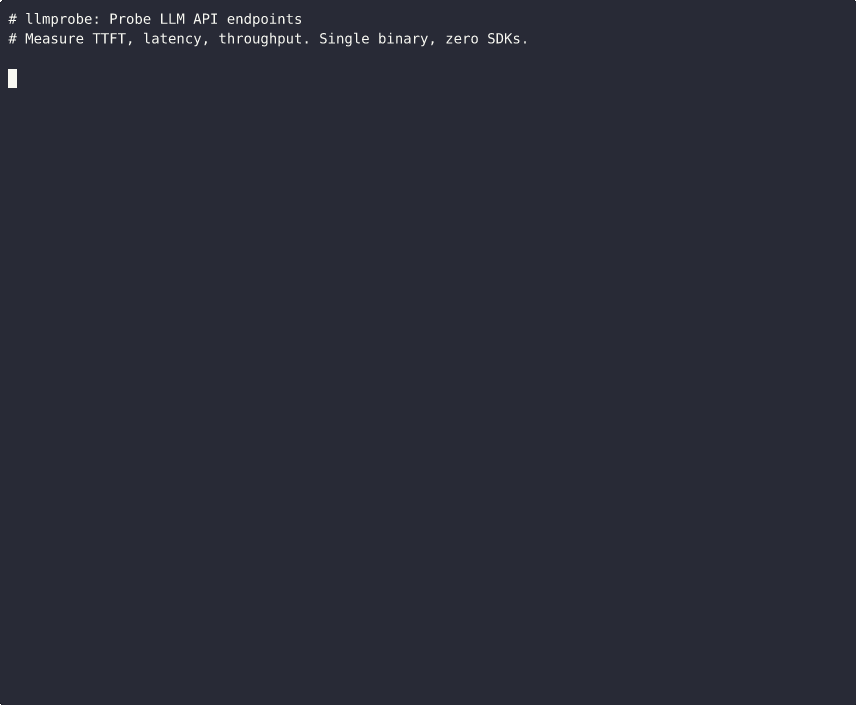

# llmprobe

> Synthetic monitoring and CI smoke tests for LLM inference endpoints. Measure TTFT, latency, throughput, and errors. Single binary, zero SDKs.

[](https://github.com/Jwrede/llmprobe/actions/workflows/ci.yml)
[](https://go.dev)
[](LICENSE)
[](https://glama.ai/mcp/servers/Jwrede/llmprobe)

llmprobe is a CLI tool for LLM serving reliability. It probes hosted APIs or
OpenAI-compatible inference servers, then reports the metrics that matter for
production user experience: time to first token (TTFT), total latency,
generation throughput (tokens/sec), and error rates.

Use it as a one-off health check, a continuous monitor, or a CI gate that
blocks deploys when your LLM provider is degraded.



## Public benchmark

[llm-bench](https://github.com/Jwrede/llm-bench) uses llmprobe to run a
continuous public benchmark of major LLM APIs. It publishes a live dashboard at
[bench.jonathanwrede.de](https://bench.jonathanwrede.de) and raw JSONL data in
[Jwrede/llm-bench-data](https://github.com/Jwrede/llm-bench-data).

This is the intended use case: repeated synthetic probes that make LLM latency,
TTFT regressions, throughput drops, and provider degradation visible before
users report them.

## Install

**Download a prebuilt binary** from the
[latest release](https://github.com/Jwrede/llmprobe/releases/latest)
(Linux, macOS, Windows; amd64 and arm64).

Or install from source:

```bash
go install github.com/Jwrede/llmprobe@latest
```

### Claude Code plugin

Install as a Claude Code plugin for `/llmprobe` skill and MCP tools:

```bash
claude plugin install Jwrede/llmprobe
```

Or register the MCP server directly:

```bash
claude mcp add --transport stdio llmprobe -- llmprobe mcp
```

llmprobe runs locally and only contacts LLM endpoints you configure.
See [PRIVACY.md](PRIVACY.md) for details.

## Quick start

llmprobe works with OpenAI, Anthropic, Google, Azure OpenAI, AWS Bedrock, and
OpenAI-compatible endpoints such as vLLM, Ollama, OpenRouter, Groq, Together AI,
Fireworks, DeepSeek, and Mistral.

Create a `probes.yml` (or copy the included example):

```yaml
providers:
  - name: openai
    api_key: ${OPENAI_API_KEY}
    models:
      - name: gpt-4o
        thresholds:
          max_ttft: 2s
      - name: gpt-4o-mini
        thresholds:
          max_ttft: 500ms

  - name: anthropic
    api_key: ${ANTHROPIC_API_KEY}
    models:
      - name: claude-sonnet-4-20250514
        thresholds:
          max_ttft: 1s
```

Run a probe:

```
$ llmprobe probe

Provider   Model                    Status    TTFT    Latency  Tok/s  Tokens  Error
--------   -----                    ------    ----    -------  -----  ------  -----
openai     gpt-4o                   healthy   312ms   2100ms   68.4   42
openai     gpt-4o-mini              healthy   98ms    814ms    112.3  56
anthropic  claude-sonnet-4-20250514 healthy   420ms   2831ms   52.1   38
azure      gpt-4o                   healthy   289ms   1950ms   71.2   44
bedrock    anthropic.claude-3-5...  degraded  1820ms  4510ms   28.1   38

4 healthy, 1 degraded, 0 errors
```

## What it measures

| Metric | What it means |
|--------|--------------|
| **TTFT** | Time from request send to first content token. This is what users feel as "lag" before the response starts streaming. |
| **Latency** | Total time from request to stream close. |
| **Tok/s** | Generation throughput: tokens produced per second after the first token. Calculated as `token_count / (latency - ttft)`. |
| **Tokens** | Total output tokens. Prefers provider usage metadata when available, falls back to SSE event counting. |
| **Status** | `healthy` if all thresholds pass, `degraded` if any threshold is exceeded, `error` if the request failed. |

## Commands

### `llmprobe probe`

One-off health check. Probes all configured endpoints and prints results.

```bash
llmprobe probe                        # table output
llmprobe probe -f json                # JSON output
llmprobe probe --fail-on degraded     # exit 1 if any endpoint is degraded
llmprobe probe -c custom-config.yml   # custom config path
```

Exit codes for CI:

| `--fail-on` | Exit 0 | Exit 1 |
|-------------|--------|--------|
| `error` (default) | healthy or degraded | any error |
| `degraded` | healthy only | degraded or error |
| `none` | always | never |

### `llmprobe watch`

Continuous monitoring. Probes all endpoints on an interval and prints a
summary line per iteration.

```bash
llmprobe watch                          # default 60s interval
llmprobe watch --interval 30s           # custom interval
llmprobe watch --tui                    # live terminal dashboard with TTFT chart
llmprobe watch --tui --load data.jsonl  # load historical data into the dashboard
llmprobe watch -f json                  # JSONL output (one line per result)
llmprobe watch --prometheus :9090       # expose Prometheus metrics
```

The `--tui` flag launches a live terminal dashboard with a TTFT chart,
color legend, and statistics table. Use `--load` to import historical
JSONL data (from `llmprobe watch -f json > data.jsonl`).


```
$ llmprobe watch --interval 30s

Watching 4 endpoints every 30s (Ctrl+C to stop)

[14:01:02] All 4 endpoints healthy.
[14:01:32] All 4 endpoints healthy.
[14:02:02] 3 healthy, 1 degraded, 0 errors. DEGRADED: openai/gpt-4o (TTFT 1820ms)
[14:02:32] All 4 endpoints healthy.
```

### `llmprobe report`

Generate a Markdown summary from JSONL probe data with p50/p95/p99
percentiles for TTFT, latency, and throughput per endpoint.

```bash
llmprobe report data.jsonl
```

Output:

```
| Provider | Model | Probes | Errors | TTFT p50 | TTFT p95 | ... | Tok/s p50 | ...
|----------|-------|--------|--------|----------|----------|-----|-----------|----
| openai   | gpt-4o | 100  | 2      | 115ms    | 188ms    | ... | 46.9      | ...
```

### `llmprobe baseline`

Create a baseline file from historical JSONL data for regression detection.

```bash
llmprobe baseline data.jsonl -o baseline.json
```

Reference the baseline in your config to use multiplier-based thresholds:

```yaml
baseline: baseline.json

providers:
  - name: openai
    api_key: ${OPENAI_API_KEY}
    models:
      - name: gpt-4o
        thresholds:
          max_ttft_multiplier: 2.0       # fail if TTFT > 2x baseline p50
          max_latency_multiplier: 2.5    # fail if latency > 2.5x baseline p50
```

This lets you detect regressions relative to your own historical data rather
than setting absolute thresholds.

## CI integration

Use `llmprobe probe` as a pre-deploy gate:

```yaml
# .github/workflows/deploy.yml
- name: Check LLM providers
  env:
    OPENAI_API_KEY: ${{ secrets.OPENAI_API_KEY }}
    ANTHROPIC_API_KEY: ${{ secrets.ANTHROPIC_API_KEY }}
  run: |
    go install github.com/Jwrede/llmprobe@latest
    llmprobe probe --fail-on degraded
```

This blocks the deploy if any LLM provider is experiencing degraded
performance right now.

When a probe fails, the output shows only the failing endpoints:

```
Failed endpoints (1/4):
  openai/gpt-4o  DEGRADED  TTFT=280ms  Latency=950ms  Tok/s=32.1
```

## MCP server

[](https://glama.ai/mcp/servers/Jwrede/llmprobe)

llmprobe includes a built-in [Model Context Protocol](https://modelcontextprotocol.io/)
server, allowing Claude Code and other MCP hosts to check LLM API health
directly from an agent workflow.

### Running the server

```bash
llmprobe mcp
```

This starts the MCP server over stdio.

### Registering with Claude Code

```bash
claude mcp add --transport stdio llmprobe -- llmprobe mcp
```

Once registered, Claude Code can call llmprobe tools during any conversation.

### Available tools

| Tool | Description |
|------|-------------|
| `probe_all` | Probe all configured endpoints from `probes.yml`. Returns TTFT, latency, throughput, and health status for every model. Accepts an optional `config` parameter for a custom config path. |
| `probe_model` | Probe a single model without a config file. Requires `provider` (openai, anthropic, google, azure, bedrock), `model` (the model identifier), and `api_key_env` (env var holding the API key). |
| `list_providers` | List all providers and models in the config file with their thresholds. Use this to discover available models before probing. |
| `get_config` | Return the full parsed configuration including defaults, providers, models, and thresholds. |

**Example use case:** An agent calls `list_providers` to see what models
are configured, then `probe_all` to verify they are healthy before
deploying changes.

## Configuration

```yaml
defaults:
  prompt: "Hello"                                # probe prompt
  max_tokens: 20                                 # max output tokens
  timeout: 30s                                   # per-probe timeout
  concurrency: 5                                 # max parallel probes

providers:
  - name: openai                    # openai, anthropic, google, azure, bedrock
    api_key: ${OPENAI_API_KEY}      # env var expansion
    base_url: https://custom.api    # optional, override endpoint
    models:
      - name: gpt-4o
        prompt: "Say hello."        # override default prompt
        max_tokens: 10              # override default max_tokens
        thresholds:
          max_ttft: 2s              # alert if TTFT exceeds this
          max_latency: 10s          # alert if total latency exceeds this
          min_tokens_per_sec: 20    # alert if throughput drops below this

  - name: azure
    api_key: ${AZURE_OPENAI_API_KEY}
    base_url: https://your-resource.openai.azure.com
    api_version: "2024-10-21"       # optional, defaults to 2024-10-21
    models:
      - name: gpt-4o               # deployment name

  - name: bedrock
    access_key: ${AWS_ACCESS_KEY_ID}
    secret_key: ${AWS_SECRET_ACCESS_KEY}
    region: us-east-1
    models:
      - name: anthropic.claude-3-5-sonnet-20241022-v2:0
```

API keys and AWS credentials support `${ENV_VAR}` syntax. Only credential
fields are expanded, so env var references in prompts or model names are
left as-is.

### OpenAI-compatible providers

Many providers (Groq, Together AI, Fireworks, DeepSeek, Mistral, OpenRouter,
Ollama, vLLM) expose an OpenAI-compatible API. These work out of the box
by setting `base_url`. Use the `label` field to distinguish multiple
OpenAI-compatible blocks:

```yaml
providers:
  # Groq
  - name: openai
    label: groq
    api_key: ${GROQ_API_KEY}
    base_url: https://api.groq.com/openai
    models:
      - name: llama-3.3-70b-versatile

  # DeepSeek
  - name: openai
    label: deepseek
    api_key: ${DEEPSEEK_API_KEY}
    base_url: https://api.deepseek.com
    models:
      - name: deepseek-chat

  # Together AI
  - name: openai
    label: together
    api_key: ${TOGETHER_API_KEY}
    base_url: https://api.together.xyz
    models:
      - name: meta-llama/Meta-Llama-3.1-70B-Instruct-Turbo

  # Local Ollama
  - name: openai
    label: ollama
    api_key: unused
    base_url: http://localhost:11434/v1
    models:
      - name: llama3.2
```

See [examples/](examples/) for ready-to-use configs for vLLM, SGLang, and Ollama.

## Prometheus metrics

Run with `--prometheus` to expose metrics for scraping:

```bash
llmprobe watch --interval 30s --prometheus :9090
```

Available metrics at `/metrics`:

| Metric | Type | Labels |
|--------|------|--------|
| `llmprobe_ttft_seconds` | gauge | provider, model |
| `llmprobe_latency_seconds` | gauge | provider, model |
| `llmprobe_tokens_per_second` | gauge | provider, model |
| `llmprobe_token_count` | gauge | provider, model |
| `llmprobe_status` | gauge | provider, model |
| `llmprobe_probes_total` | counter | provider, model |
| `llmprobe_errors_total` | counter | provider, model |

The `llmprobe_status` gauge encodes health as: 1 = healthy, 0.5 = degraded,
0 = error. Use this for alerting in Grafana or Alertmanager.

## Architecture

```
probes.yml
  -> Config loader (YAML + env var expansion)
    -> Probe engine (concurrent goroutines per provider/model)
      -> Provider clients (raw HTTP + SSE parsing, no SDKs)
        -> Results (TTFT, latency, tokens/sec, status)
          -> Output (table, JSON, JSONL)
```

Each provider client is a thin HTTP wrapper that sends a streaming request
and parses the response. No LLM SDKs are imported. The SSE parser handles
both data-only events (OpenAI, Google) and named events (Anthropic). The
Bedrock client implements SigV4 signing and AWS binary event stream parsing
from scratch.

TTFT is measured from the moment the HTTP request is sent to the first
event that contains actual content text (not role assignments or metadata).

## Providers

| Provider | Endpoint | Auth | Streaming format |
|----------|----------|------|-----------------|
| OpenAI | `/v1/chat/completions` | `Authorization: Bearer` | SSE, `[DONE]` sentinel |
| Anthropic | `/v1/messages` | `x-api-key` header | named-event SSE |
| Google | `/v1beta/models/{model}:streamGenerateContent?alt=sse` | `key` query param | SSE |
| Azure OpenAI | `/openai/deployments/{model}/chat/completions` | `api-key` header | SSE, `[DONE]` sentinel |
| AWS Bedrock | `/model/{model}/converse-stream` | SigV4 | AWS binary event stream |
| OpenAI-compat | `/v1/chat/completions` (custom base_url) | `Authorization: Bearer` | SSE |

OpenAI-compatible covers: Groq, Together AI, Fireworks, DeepSeek, Mistral,
OpenRouter, Ollama, vLLM, and any endpoint that speaks the OpenAI chat
completions API.

## Roadmap

- OpenTelemetry metric/span export for integration with Datadog and Honeycomb
- Structured output validation: verify JSON mode responses parse correctly
- Histogram-based Prometheus metrics for multi-instance aggregation

## License

MIT
