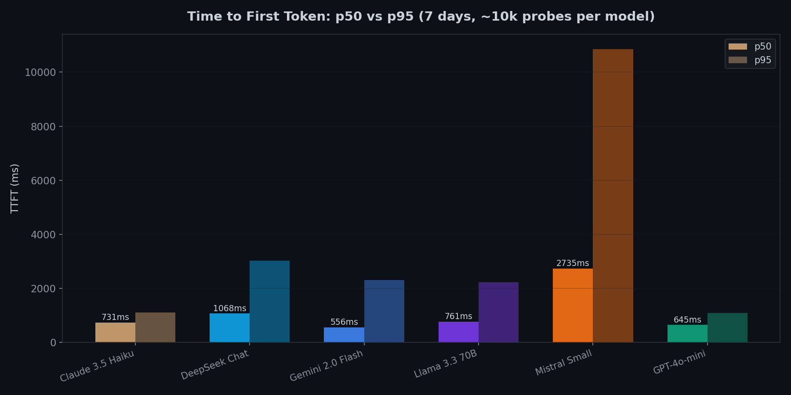
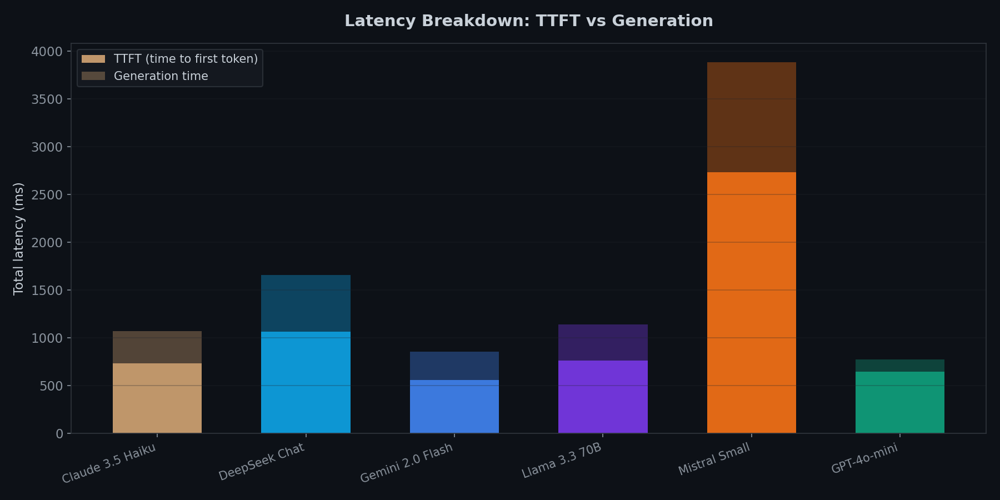
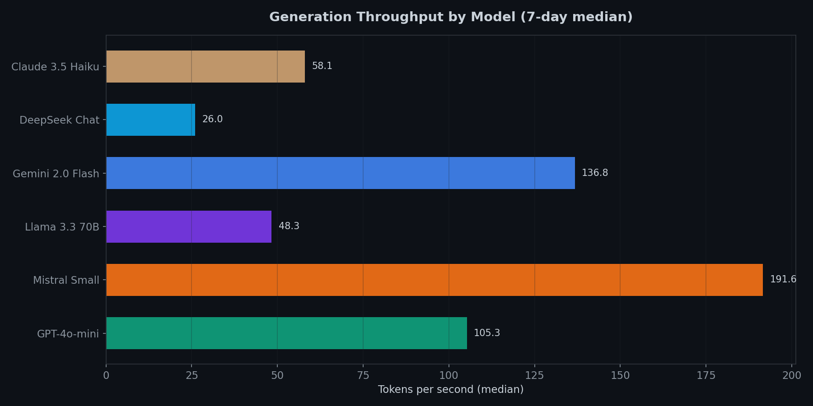
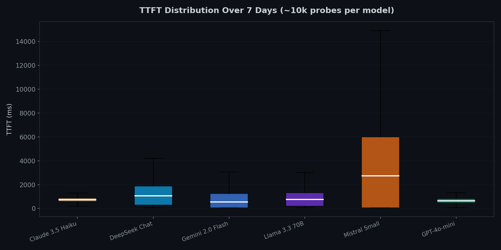
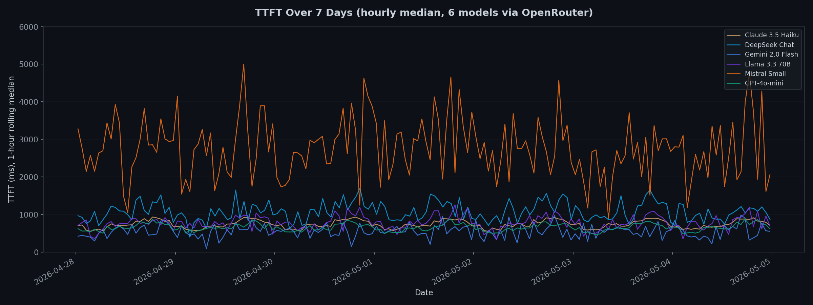

# I Monitored 6 LLM APIs for 7 Days. Here's What I Found.

If you're building production applications on top of LLM APIs, you've probably
noticed something: the latency numbers in provider docs don't match reality.
Marketing pages show best-case benchmarks. Your users experience the p95.

I built [llmprobe](https://github.com/Jwrede/llmprobe), an open-source CLI
tool that probes LLM endpoints and measures time to first token (TTFT), total
latency, and generation throughput. Then I pointed it at 6 popular models and
let it run for 7 days.

## Setup

All models were accessed through [OpenRouter](https://openrouter.ai/) to
normalize the routing layer. Each model was probed every 60 seconds with a
minimal prompt ("Hello", max 20 tokens) to isolate infrastructure latency from
model reasoning time.

**Models tested:**
- OpenAI GPT-4o-mini
- Anthropic Claude 3.5 Haiku
- Google Gemini 2.0 Flash
- Meta Llama 3.3 70B Instruct (via Together/Fireworks)
- DeepSeek Chat
- Mistral Small (2603)

**Total probes: 60,480** (~10,080 per model over 7 days)

## The headline numbers

| Model | TTFT p50 | TTFT p95 | Latency p50 | Tok/s | Errors |
|-------|----------|----------|-------------|-------|--------|
| GPT-4o-mini | 645ms | 1,094ms | 776ms | 105.3 | 0 |
| Claude 3.5 Haiku | 731ms | 1,106ms | 1,073ms | 58.1 | 0 |
| Gemini 2.0 Flash | 556ms | 2,313ms | 853ms | 136.8 | 0 |
| Llama 3.3 70B | 761ms | 2,221ms | 1,141ms | 48.3 | 2 |
| DeepSeek Chat | 1,068ms | 3,017ms | 1,656ms | 26.0 | 4 |
| Mistral Small | 2,735ms | 10,852ms | 3,886ms | 191.6 | 3 |

## Finding 1: p50 and p95 tell very different stories



Gemini 2.0 Flash has the lowest median TTFT at 556ms, but its p95 jumps to
2,313ms. That's a 4x multiplier. GPT-4o-mini and Claude 3.5 Haiku are more
predictable: their p95 is only about 1.7x their p50.

This matters for production. If you're setting a timeout or SLA, the p50
gives you a false sense of security. One in twenty requests will take 2-4x
longer than the median.

**Mistral Small is the outlier.** Its p50 of 2,735ms is already slow, and
the p95 of 10,852ms means roughly 5% of requests take over 10 seconds to
start streaming. This was consistent across the full 7-day window, not a
temporary degradation.

## Finding 2: Fastest first token != fastest generation



TTFT measures how long until the response starts streaming. But the total
time to completion depends on generation speed too.

Mistral Small has the worst TTFT by far, but once it starts generating, it
produces tokens at 191.6 tok/s, the fastest in the test. Gemini 2.0 Flash
is second at 136.8 tok/s.

DeepSeek Chat is slow on both fronts: 1,068ms TTFT and only 26.0 tok/s
generation throughput. For applications that need to display a full response
quickly, DeepSeek was the worst performer in this test.

## Finding 3: Throughput varies wildly across models



The spread here is almost 8x between the fastest (Mistral Small at 191.6
tok/s) and slowest (DeepSeek Chat at 26.0 tok/s). If you're generating
longer responses, this difference compounds: a 500-token response takes
2.6 seconds on Mistral but 19 seconds on DeepSeek.

GPT-4o-mini at 105.3 tok/s and Gemini 2.0 Flash at 136.8 tok/s offer a
good balance of fast TTFT and fast generation.

## Finding 4: Tail latency is where reliability breaks down



The box plots show the full distribution. Most models have a tight
interquartile range, but the whiskers tell the real story.

GPT-4o-mini and Claude 3.5 Haiku have the tightest distributions. You can
set aggressive timeouts (2s) and rarely hit them. Gemini and Llama have
longer tails, occasionally spiking to 3-4x their median. Mistral's
distribution is so wide that it's effectively unpredictable for latency-
sensitive applications.

## Finding 5: The 7-day view reveals patterns the one-off probe misses



Running for 7 days exposes patterns that a quick benchmark never would:

- **Mistral Small** had periodic latency spikes throughout the week, often
  exceeding 5,000ms. This wasn't a one-time incident.
- **DeepSeek Chat** showed elevated latency during certain windows,
  likely correlated with peak usage in Asian time zones.
- **GPT-4o-mini and Claude 3.5 Haiku** were remarkably stable. Their lines
  barely fluctuate across the full week.
- **Gemini 2.0 Flash** was mostly fast but had occasional spikes that
  brought its p95 up significantly.

## Recommendations

**For latency-sensitive applications** (chatbots, real-time assistants):
GPT-4o-mini or Gemini 2.0 Flash. Both have sub-700ms median TTFT and fast
generation. GPT-4o-mini is more predictable; Gemini is slightly faster at
the median but has wider tails.

**For throughput-sensitive applications** (batch processing, summarization):
Mistral Small if you can tolerate the TTFT, as it generates tokens faster
than anything else tested. Otherwise, Gemini 2.0 Flash offers the best
all-around throughput without the latency penalty.

**For reliability** (SLA-bound, enterprise):
GPT-4o-mini and Claude 3.5 Haiku. Zero errors over 10,080 probes each,
tight latency distributions, no time-of-day variation. These are the ones
you can put a timeout on and sleep at night.

**Avoid for latency-sensitive work:**
Mistral Small (high TTFT, wild variance) and DeepSeek Chat (slow on all
axes). Both had errors during the test and unpredictable latency patterns.

## How to run your own benchmark

All of this was measured with [llmprobe](https://github.com/Jwrede/llmprobe),
an open-source Go CLI. Install it and run your own continuous monitor:

```bash
go install github.com/Jwrede/llmprobe@latest
```

Create a config file:

```yaml
defaults:
  prompt: "Hello"
  max_tokens: 20
  timeout: 30s
  concurrency: 6

providers:
  - name: openai
    api_key: ${OPENROUTER_API_KEY}
    base_url: https://openrouter.ai/api
    models:
      - name: openai/gpt-4o-mini
      - name: anthropic/claude-3.5-haiku
      - name: google/gemini-2.0-flash-001
```

Run a continuous monitor with the live TUI dashboard:

```bash
llmprobe watch --tui --interval 60s
```

Or collect JSONL data for later analysis:

```bash
llmprobe watch --interval 60s -f json > benchmark.jsonl
```

The tool supports OpenAI, Anthropic, Google, Azure, AWS Bedrock, and any
OpenAI-compatible endpoint (Groq, Together, Fireworks, DeepSeek, Mistral,
OpenRouter, Ollama, vLLM). No SDKs are imported. It's raw HTTP + SSE parsing.

## Methodology notes

- All probes went through OpenRouter, which adds a small routing overhead.
  Direct API calls would likely be 50-100ms faster on TTFT.
- The prompt was intentionally minimal ("Hello", max 20 tokens) to measure
  infrastructure latency, not model reasoning time.
- Token counts are from provider usage metadata when available, with SSE
  event counting as fallback.
- TTFT is measured from HTTP request send to first content token (not role
  assignments or metadata events).
- Error rate was 9/60,480 (0.015%). All errors were transient (timeouts or
  rate limits).

---

*llmprobe is open source: [github.com/Jwrede/llmprobe](https://github.com/Jwrede/llmprobe).
Star it if you find this useful, or open an issue if you want to see
additional providers or metrics.*
